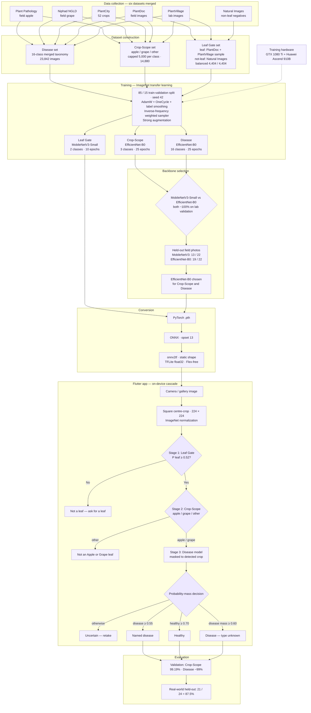

<div align="center">

# 🌿 AgroEye

### On-device AI for Apple & Grape Leaf Disease Classification

**A three-stage, offline computer-vision pipeline designed for practical agricultural use.**


**[Watch the demo](#-video-demo) · [Explore the architecture](#-system-architecture) · [View results](#-evaluation--results)**

</div>

---

## Overview

**AgroEye** is a final-year project that brings deep-learning-based leaf disease classification directly to an Android smartphone. A user captures or selects a leaf photograph; AgroEye validates the input, identifies whether it belongs to a supported crop, and then classifies its healthy or disease condition—all **without requiring an internet connection for inference**.

Rather than forcing every uploaded image into a disease category, AgroEye uses a **three-stage cascade** with explicit rejection paths. The project focuses on **Apple and Grape leaves**, with **16 supported healthy/disease classes** in its final classifier.

> **Research focus:** balancing model accuracy, field-image generalization, compact deployment, and a usable offline mobile experience. AgroEye is a decision-support tool, not a substitute for professional agricultural diagnosis.

## ✨ Highlights

- **Three-stage validation:** checks for a leaf, checks crop scope, then predicts a supported healthy/disease class.
- **Offline by design:** TensorFlow Lite models execute on the device through the Flutter application.
- **Purpose-built backbones:** MobileNetV3-Small for Leaf Gate; EfficientNet-B0 for Crop-Scope and Disease Classification.
- **Input rejection:** non-leaf images and unsupported crops do not have to receive a forced disease label; uncertain cases can prompt a retake or an unknown-type result.
- **Crop-aware predictions:** disease outputs are restricted to the crop identified by Crop-Scope.
- **Farmer-friendly experience:** camera/gallery input, predicted label, confidence display, guidance, closest matches, and locally stored scan history.
- **Field-oriented evaluation:** independent smartphone photographs are evaluated separately from development-set validation.

## 🎬 Video demo

[](https://youtube.com/shorts/SxthHYNvYRo?si=3X06b-2Pmd__E2Ww)

**[▶ Watch the AgroEye demo on YouTube](https://youtube.com/shorts/SxthHYNvYRo?si=3X06b-2Pmd__E2Ww)**

## 🧠 How it works

```text
Camera / gallery image
        │
        ▼
Image preprocessing (224 × 224 RGB, model-specific normalization)
        │
        ▼
[1] Leaf Gate · MobileNetV3-Small
        ├── Not a leaf ──► Ask for a leaf image
        │
        ▼
[2] Crop-Scope · EfficientNet-B0
        ├── Other crop ──► Unsupported crop message
        │
        ▼
[3] Disease Classifier · EfficientNet-B0
        │   Crop-aware output restriction + uncertainty handling
        ▼
Healthy / named disease / type unknown / retake
        │
        ▼
On-device result screen and scan history
```

The stages are **separate trained classifiers**, even where they use the same EfficientNet-B0 backbone. Crop-Scope selects **Apple / Grape / Other**; the final classifier contains **6 Apple classes and 10 Grape classes**.

## 🏗️ System architecture

The complete AgroEye architecture is displayed **directly in this README**. GitHub renders the diagram below from Mermaid—no separate architecture image or `assets/` folder is needed.



The diagram follows the project's dataset collection, model training and selection, PyTorch → ONNX → TensorFlow Lite conversion, offline Flutter inference, and evaluation workflow.

## 📊 Evaluation & results

**Reported results from the FYP evaluation; these measurements refer to different test setups and should not be treated as a single end-to-end accuracy figure.**

| Evaluation | Reported result | What it measures |
| --- | ---: | --- |
| Crop-Scope validation | **99.19% best accuracy** | Performance on the reported validation set |
| Final real-world species identification | **21 / 24 (87.5%)** | Correct crop/species identification on held-out field photographs |
| MobileNetV3-Small, field comparison | **13 / 22 (≈59%)** | Crop identification on a separate 22-image comparison |
| EfficientNet-B0, field comparison | **19 / 22 (≈86%)** | Crop identification on that same 22-image comparison |

The held-out comparisons motivated the use of **EfficientNet-B0 for Crop-Scope**, while **MobileNetV3-Small remains the lightweight Leaf Gate**. The final application bundles three TFLite models totaling approximately **38 MB**.

**Interpretation:** near-perfect validation performance does **not** imply near-perfect performance on unseen field photographs. The real-world evaluation is small and measures species identification—not the complete, end-to-end disease-diagnosis accuracy of the cascade.

## 🌱 Data & supported classes

Training combines laboratory-style and field-image sources, including **PlantVillage, PlantDoc, PlantCity, Niphad Grape Leaf Disease, Plant Pathology (Apple)**, and **Natural Images** (non-leaf examples for the Leaf Gate). The reported disease-training set contains **23,842 images across 16 classes**.

| Apple · 6 classes | Grape · 10 classes |
| --- | --- |
| Apple Scab | Grape Black Rot |
| Apple Black Rot | Grape Esca |
| Apple Cedar Rust | Grape Leaf Blight |
| Apple Black Spot | Grape Anthracnose |
| Apple Brown Spot | Grape Brown Spot |
| Apple Healthy | Grape Downy Mildew |
| | Grape Mites |
| | Grape Powdery Mildew |
| | Grape Shot Hole |
| | Grape Healthy |

To support generalization, the training approach uses transfer learning, data augmentation, class balancing, and a scheduled learning rate. Public source datasets and the independent field-evaluation photographs serve different purposes; development-set performance should not be substituted for field-test results.


## ⚠️ Scope & limitations

- Supports **Apple and Grape** only, within the **16 trained healthy/disease classes**.
- Non-green leaves, whole-plant images, and poorly framed or unfamiliar inputs may be rejected or misclassified.
- An unsupported disease is not guaranteed to be recognized correctly as *unknown*.
- The reported held-out field evaluation is small; broader field testing is needed to estimate performance across growing conditions and devices.
- Predictions are AI-generated decision support; seek expert confirmation before taking consequential crop-treatment decisions.

## 🔭 Future work

Expand the field-image benchmark, improve handling of unusual leaf colors and framing, extend the supported crop/disease taxonomy, and evaluate end-to-end performance on a wider range of Android devices.

## 👩‍💻 Project author & supervisor

**Project author:** Qurat UL Ain  
**Supervisor:** Sir Imran Shaffi  
**Department of Computing, Abasyn University Islamabad Campus**

---

<div align="center">

**AgroEye · Scan · Protect · Grow**

*Made as a final-year project to explore accessible, offline agricultural AI.*

</div>
